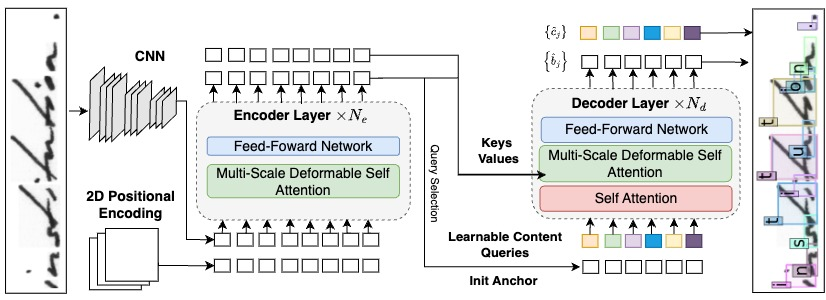

<div align="center">

# General Detection-based Text Line Recognition (DTLR)

<font size="4">
<a href="https://scholar.google.com/citations?user=8MU98WQAAAAJ&hl=en">Raphael Baena</a>&emsp;
<a href="https://imagine-lab.enpc.fr/staff-members/syrine-kalleli/">Syrine Kalleli</a>&emsp;
<a href="https://imagine.enpc.fr/~aubrym/">Mathieu Aubry</a>&emsp;
</font>
<br>

</div>


## Description

This repository is the official implementation for [General Detection-based Text Line Recognition](https://detection-based-text-line-recognition.github.io/), 
the paper is available on [arXiv]().

This repository builds on the code for [DINO-DETR](https://github.com/IDEA-Research/DINO), the official implementation of the paper "[DINO: DETR with Improved DeNoising Anchor Boxes for End-to-End Object Detection](https://arxiv.org/abs/2203.03605)". We present a model that adapts DINO-DETR for text recognition as a detection and recognition task. The model is pretrained on synthetic data using the same loss as DINO-DETR and then fine-tuned on a real dataset with CTC loss.
<p align="center">
  
</p>

## Content
<details>
<summary>Installation, Datasets, and Weights</summary>


## Installation, Datasets, and Weights
### 1. Installation
The model was trained with `python=3.11.0`, `pytorch=2.1.0`, `cuda=11.8` and builds on the DETR-variants [DINO](https://arxiv.org/abs/2203.03605)/[DN](https://arxiv.org/abs/2203.01305)/[DAB](https://arxiv.org/abs/2201.12329) and [Deformable-DETR](https://arxiv.org/abs/2010.04159).

1. Clone this repository and create a virtual environment
2. Follow instructions to install a [Pytorch](https://pytorch.org/get-started/locally/) version compatible with your system and CUDA version
3. Install other dependencies
    ```bash
    pip install -r requirements.txt
    ```
4. Compiling CUDA operators
    ```bash
    python src/models/dino/ops/setup.py build install # 'cuda not available', run => export CUDA_HOME=/usr/local/cuda-<version>
    # unit test (should see all checking is True) # could output an outofmemory error
    python src/models/dino/ops/test.py
    ```
### 2. Datasets
Datasets should be placed in the appropriate folder specified in **datasets/config.json**. We preprocess the images and annotations for the IAM dataset, while all other datasets are used in their original form.
For each dataset (except IAM), a charset file (.pkl) is required. Charset files can be found in the folder [data](data).

**Handwritten**
1. IAM: the official website is [here](http://www.fki.inf.unibe.ch/databases/iam-handwriting-database). We preprocess the images and annotation following the instruction in the [PyLai Repository](https://github.com/carmocca/PyLaia-examples/tree/master/iam-htr). The annotations are stored in [data/IAM_new/labels.pkl](data/IAM_new).
2. RIMES: TEKLIA provide the dataset [here](https://teklia.com/research/rimes-database/). After downloading, place the charset file in the same folder as the dataset.
3. READ: the dataset is available [here](https://zenodo.org/records/1297399). After downloading, place the charset file in the same folder as the dataset.

**Chinese**
The official website is [here](https://nlpr.ia.ac.cn/databases/handwriting/Download.html). Images and annotations are provide only in bytes format for these datasets.
1. CASIA v1: Download the dataset in bytes format with the link above and place the charset in the same folder as the dataset.
2. CASIA v2: We provide directly a version of the dataset with images (PNG) and annotations (TXT). Download the dataset [here](https://drive.google.com/file/d/1ZfrsxBM2uhnqa0vps-8950ZFflYgMHin/view?usp=sharing).

**Ciphers**
The ciphers borg and copiale are available [here](https://pages.cvc.uab.es/abaro/datasets.html). The charset files are provided in the folder [data](data).
### 3. Weights
Pretrained checkpoints can be found [here](https://drive.google.com/file/d/1sr-CSCdiVhCuUmZa3danqSvdzIvj8Pdl/view?usp=sharing). The folder includes the weights of the following **pretrained** models:

- **General model**: Trained on random Latin characters. Typically used for finetuning on ciphers.
- **English model**: Trained on English text with random erasing. Typically used for finetuning on IAM.
- **French model**: Trained on French text with random erasing. Typically used for finetuning on RIMES.
- **German model**: Trained on German text with random erasing. Typically used for finetuning on READ.
- **Chinese model**: Trained on random handwritten Chinese characters from HWDB 1. Typically used for finetuning on HWDB 2.

Finetuned checkpoints can be found [here](https://drive.google.com/file/d/11UXYJHBKhgI6DhhkqQ6UpHFRXt3XNFQA/view?usp=sharing).

Checkpoints should be organized as follows:
```bash
  logs/
    └── IAM/
      └── checkpoint.pth
    └── other_model/
      └── checkpoint.pth
    ...
```
</details> 
<details>
<summary>Pretraining</summary>

# Pretraining
Pretraining scipts are available in **scripts/pretraining**.
## Latin scripts 
You need  to download the folder [resources](https://drive.google.com/file/d/1XxeizTec4XOsLfyV_Q_dVQ1rMNWzbmoO/view?usp=sharing) (background, fonts, noises, texts)  and place it in the folder **dataset**.

To train models with random erasing:
```bash
sh scripts/pretraining/Synthetic_english_w_masking.sh
sh scripts/pretraining/Synthetic_german_w_masking.sh
sh scripts/pretraining/Synthetic_french_w_masking.sh
sh scripts/pretraining/Synthetic_general.sh
```
## Chinese scripts 
You need the dataset CASIA v1 [here]

To train a model with random erasing
```bash
sh scripts/pretraining/Synthetic_english.sh
```
Then for instances to train a model for chinese with random erasing:
```bash
bash scripts/pretraining/Synthetic_chinese_w_masking.sh
```
</details> 
<details>
<summary>Finetuning</summary>

# Finetuning
Finetuning occurs in two stages. The scripts are available in **scripts/finetuning.**. For Step 1 it is expected that a model is pretrained is placed in the folder **logs/your_model_name**.

</details> 
<details>
<summary>Evaluation</summary> 

# Evaluation 
Use the scripts in **scripts/evaluating** to evaluate the model on the different datasets. 

</details> 
<details>
<summary>Ngram</summary>

# Ngram
## Evaluation
We provide our N-gran models for RIMES, READ and IAM [here](). We strongly advice to create a separate environment for the ngram model and to install the libraries in the [ngram/mini_guide.md](ngram/mini_guide.md).
To run an evalutation with the ngram model:
```bash
bash python ngram/clean_gen_ngram_preds.py --config_path ngram_decoder/IAM.yaml
bash python ngram/clean_gen_ngram_preds.py --config_path ngram_decoder/READ.yaml
bash python ngram/clean_gen_ngram_preds.py --config_path ngram_decoder/RIMES.yaml
```
## Training a ngram model
To train you own ngram model, follow the instructions in the [ngram/mini_guide.md](ngram/mini_guide.md)
</details> 
  
## Citation

If you find this code useful, don't forget to <b>star the repo :star:</b> and <b>cite the papers :point_down:</b>

```                         
@article{baena2024DTLR, title={General Detection-based Text Line Recognition}, 
author={Raphael Baena and Syrine Kalleli and Mathieu Aubry}, 
journal={arXiv preprint arXiv:},
year={2024}}  
```


